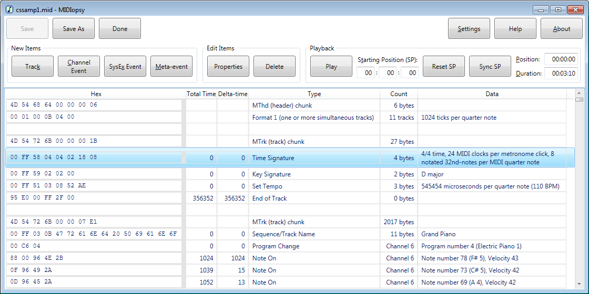

MIDIopsy is a Windows application that is used to view, play, and edit the binary contents of [standard MIDI (musical instrument digital interface) files](https://www.midi.org/specifications-old/item/standard-midi-files-smf).

Home Page:  https://jeffbourdier.github.io/midiopsy

