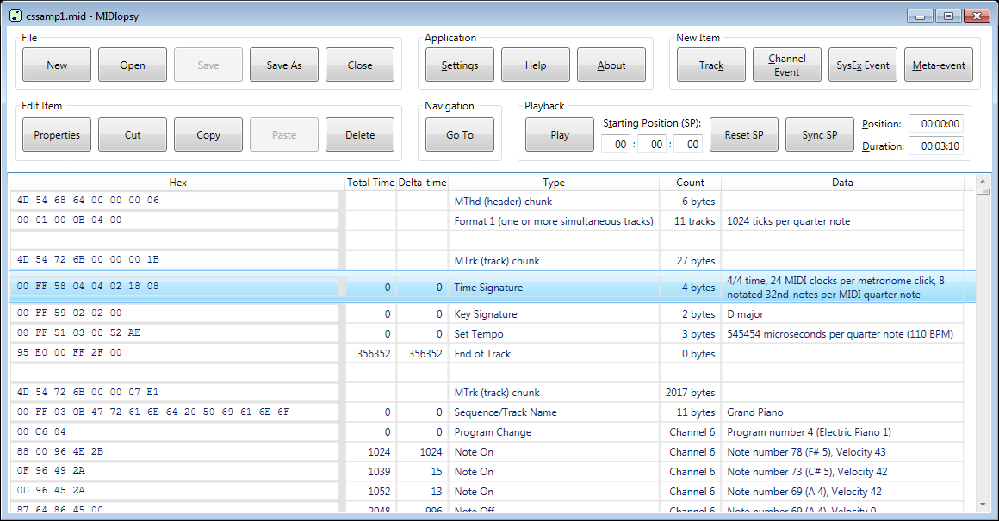

MIDIopsy is a Windows application that is used to view the binary contents of a standard [MIDI (musical instrument digital interface) file](https://www.midi.org/specifications-old/item/standard-midi-files-smf), with user-friendly comments.

